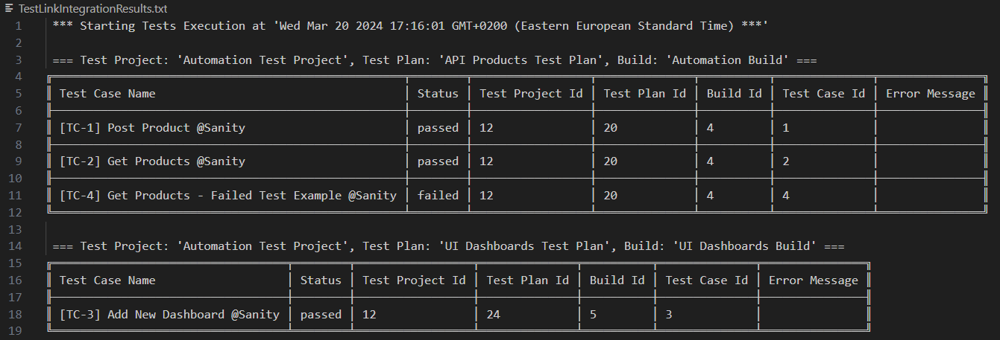

# playwright-typescript-template
Simple Template For Playwright Template Written In Typescript With API/UI Tests Examples

## How To Start?
- Clone repository
- Install dependencies

    ```bash
    npm install
    ```
- Run all tests

    ```bash
    npm run all-tests
    ```

- Open Demo Report Portal: https://demo.reportportal.io ( <i>default/1q2w3e</i> )
- Find latest Launch with name "Playwright TypeScript Test Launch#N" and view results

## What Is The Structure?
- ### core.api - directory that contains api related files
    * /clients
    * /contracts
    * /enums
    * /utils

- ### core.ui - directory that contains ui related files
    * /enums
    * /pages
    * /utils

- ### tests - directory that contains tests related files

    * /api
    * /base
    * /fixtures - playwright [fixtures](https://playwright.dev/docs/test-fixtures) for api and ui tests
    * /ui

- ### utils - directory that contains common utils related files

    * /common
        * scenarios.generator.ts - read all tests and save all comments as txt files into scenarios directory
        * test.link.helper.ts - helper that help to populate results into TestLink

- ### environments.ts - file with different environments variables

- ### playwright.config.ts - file with playwright configuration

## How To Do Something?

- ### How to specify some additional environment variable?
    - To run tests and specify some additional variable you can use cross-env. Like this:
        ```bash
        npx cross-env ENV=dev SOME_ADDITIONAL_VAR='SOME VALUE' playwright test
        ```
- ### How to generate test scenarios?
    - To generate txt files with test scenarios run specified command. Files will be saved into scenarios directory:
        ```bash
        npm run generate-scenarios
        ```
- ### How to provide TestLink data as env variables via cpmmand line?
    - You can set specific TestLink Project/Test Plan/Build via command line:
        ```bash
        npx cross-env TESTLINK_TEST_PROJECT="Automation Test Project" TESTLINK_TEST_PLAN="Automation Test Plan" TESTLINK_BUILD="Automation Build" playwright test --grep "@API"
        ```
    - You can set specific TestLink Project/Test Plan/Build via code in test suite:
        ```js
          /**
            * Prerequisites Before All: 
            * Get TestLink Integration Data
            */
            test.beforeAll(async ({ }) => {
                // --- Here you can do some global preparation steps ---
                TestLinkConfig.plan = 'UI Dashboards Test Plan';
                TestLinkConfig.build = 'UI Dashboards Build';
                TestLinkHelper.getTestLinkIntegrationData();
            });
        ```
- ### How to review TestLink integration statistic and analyze errors during integration process?
    - After each run in root of project file 'TestLinkIntegrationResults.txt' will be generated with TestLink integration statistic:
    
    - Same table will in in Console output after each spec file execution
    - Requests will be logged into Console and ReportPortal as well
    - If integration will fail it will not fail test execution. To fail execution in test tear down you need to uncomment code in 'utils\common\test.link.helper.ts' for method 'setTestCaseStatus':
        ```js
        await validateStatusCode(executionResponse, 200);
        ```

## License

[ISC](https://choosealicense.com/licenses/isc/)